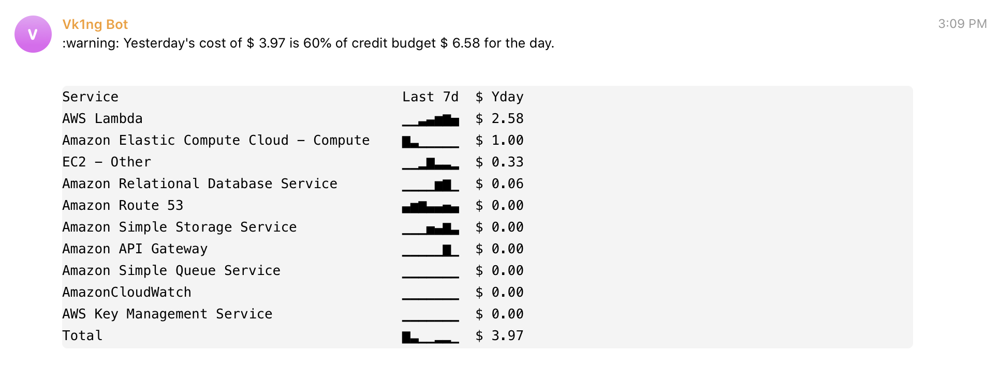

# AWS Billing to Telegram



Sends daily breakdowns of AWS costs to Telegram account.

# Install

1. Install [`serverless`](https://serverless.com/), which I use to configure the AWS Lambda function that runs daily.

   ```
   npm install -g serverless
   npm install
   ```

2. Create a Bot throught Bot Father and get token.

3. Deploy the system into your AWS account.

   ```
   serverless deploy --access_key="_SECRET_" --secret_key="_SECRET_" --telegram_user="_SECRET_" --telegram_bot_token="_SECRET_"
   ```

   You can also run it once to verify that it works:

   ```
   serverless invoke --function report_cost
   ```

## Support for AWS Credits

If you have AWS credits on your account and want to see them taken into account on this report, head to [your billing dashboard](https://console.aws.amazon.com/billing/home?#/credits) and note down the "Expiration Date", "Amount Remaining", and the "as of" date towards the bottom of the page. Add all three of these items to the command line when executing the `deploy` or `invoke`:

    ```
    serverless deploy --access_key="_SECRET_" --secret_key="_SECRET_" --telegram_user="_SECRET_" --telegram_bot_token="_SECRET_" --credits_expire_date="mm/dd/yyyy" --credits_remaining_date="mm/dd/yyyy" --credits_remaining="xxx.xx"
    ```
